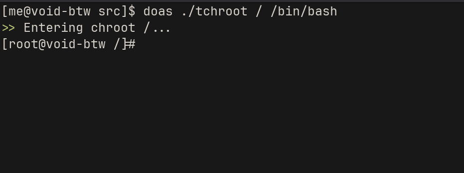

# tchroot
`tchroot` is a `chroot` wrapper, which itself mounts the necessary pseudo-file systems and creates a chroot into the directory specified by the first argument, with the shell specified by the second argument.

## Why use tchroot?
Instead of typing:
```sh
mount --types proc /proc /mnt/example/proc
mount --rbind /sys /mnt/example/sys
mount --make-rslave /mnt/example/sys
mount --rbind /dev /mnt/example/dev
mount --make-rslave /mnt/example/dev
mount --bind /run /mnt/example/run
mount --make-slave /mnt/example/run
chroot /mnt/example /bin/bash
```
You can simply run:
```sh
tchroot /mnt/example /bin/bash
```

## Installation

```sh
# TBA
```

## Images

^ Chrooting into `/` with `tchroot`.

## License
**MIT** (**X11**). See [LICENSE.md](LICENSE.md) for details.